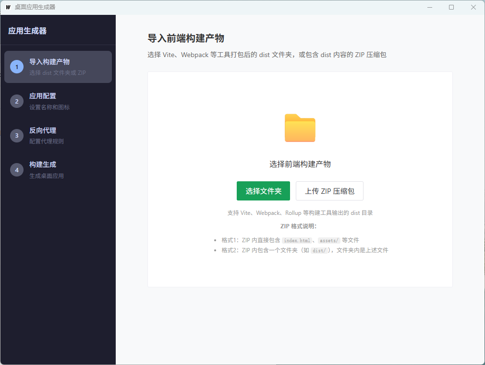
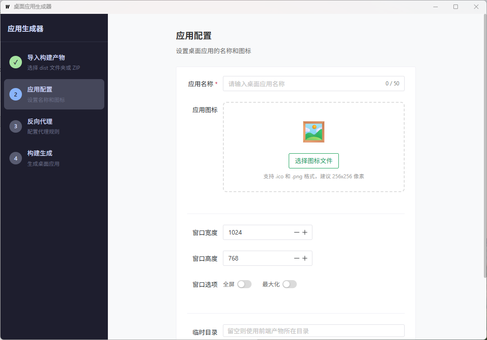
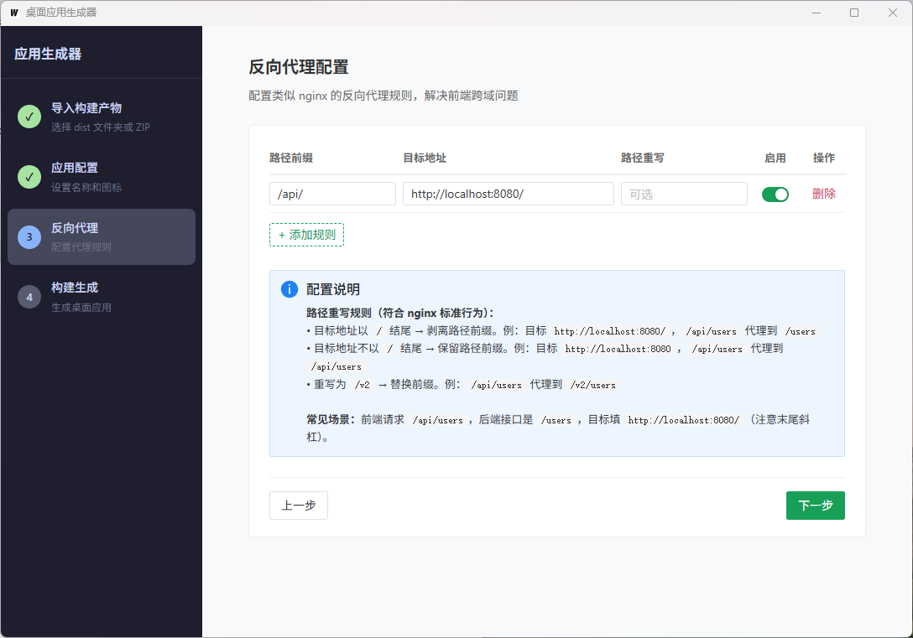
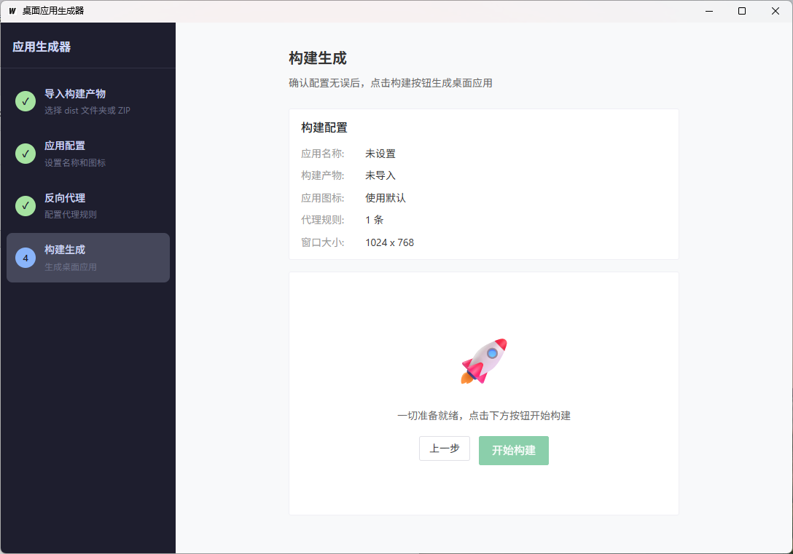

# Deploy App


Deploy App 是一个基于 Wails 的 Windows 桌面应用打包工具。它可以把已经构建好的前端项目（Vue、React、Angular、静态站点等）打包成独立的 `.exe` 应用，并支持自定义图标、窗口大小和反向代理规则。

这个项目的目标很直接：让前端应用在不改业务代码的情况下，快速生成一个可分发的 Windows 桌面程序。

## 界面预览

### 导入构建产物



### 应用配置



### 反向代理配置



### 构建生成



## 功能特性

- 单文件输出：生成一个独立的 `.exe` 文件，便于复制和分发。
- 零 Go 依赖打包：最终用户使用打包工具时，不需要安装 Go 环境。
- 自定义应用图标：支持 `.ico` 和 `.png` 图标，并同步到 exe 图标和窗口标题栏图标。
- 窗口配置：支持窗口宽度、高度、最大化和全屏模式。
- 反向代理：内置类似 nginx 的代理规则，适合前端接口跨域或本地服务转发。
- 静态资源嵌入：前端 `dist` 文件会被打进 exe 内部，运行时自动加载。
- ZIP 导入：支持直接选择 `dist` 文件夹，也支持上传构建产物 ZIP 包。

## 适用场景

- 将内部管理后台快速封装为 Windows 桌面应用。
- 给纯前端项目生成可双击运行的交付包。
- 需要把前端静态资源和少量代理配置打包进一个 exe。
- 希望分发给非技术用户，不要求对方安装 Node.js、Go 或命令行工具。

## 快速使用

### 使用发布版本

1. 从 GitHub Releases 下载最新的 `deploy-app.exe`。
2. 双击运行。
3. 导入前端项目的 `dist` 目录，或上传包含构建产物的 ZIP 包。
4. 设置应用名称、图标、窗口大小和代理规则。
5. 点击“开始构建”，选择保存位置，生成最终 exe。

### ZIP 包格式

支持两种常见结构：

```text
dist.zip
  index.html
  assets/
  ...
```

```text
dist.zip
  dist/
    index.html
    assets/
    ...
```

## 从源码运行

### 环境要求

- Windows 10/11 64-bit
- Go 1.23+
- Node.js 20+
- Wails CLI v2

### 安装依赖

```bash
cd frontend
npm install
cd ..
```

### 启动开发模式

```bash
wails dev
```

### 构建前端

```bash
cd frontend
npm run build
cd ..
```

### 重新生成基础运行壳

修改 `templates/generated-app/` 后，需要重新生成基础 exe：

```bash
go run ./cmd/build-base
```

### 构建 Deploy App

```bash
wails build
```

构建产物默认输出到：

```text
build/bin/deploy-app.exe
```

## 使用流程

### 1. 导入前端构建产物

选择前端项目构建后的 `dist` 文件夹，或上传 ZIP 压缩包。目录中必须包含 `index.html`。

### 2. 配置应用信息

设置生成应用的名称、图标和窗口参数。图标支持 `.ico` 和 `.png`，建议使用 256x256 或更高尺寸的正方形图片。

### 3. 配置反向代理

代理规则用于把前端请求转发到后端服务，路径处理规则如下：

| 配置方式 | 行为 | 示例 |
| --- | --- | --- |
| 目标地址以 `/` 结尾 | 剥离路径前缀 | `/api/users` -> `/users` |
| 目标地址不以 `/` 结尾 | 保留路径前缀 | `/api/users` -> `/api/users` |
| 设置“重写为” | 替换路径前缀 | `/api/users` -> `/v2/users` |

示例：

```text
路径前缀: /api/
目标地址: http://localhost:8080/
重写为:   留空
```

当前端请求 `/api/users` 时，会代理到 `http://localhost:8080/users`。

### 4. 构建生成

确认配置后点击“开始构建”，工具会复制基础运行壳、写入图标资源、打包前端资源，并输出最终 exe。

## 工作原理

Deploy App 内置一个预编译的 Wails 基础运行壳 `base.exe`。构建时不会现场编译用户应用，而是把前端资源和配置追加到 `base.exe` 尾部：

```text
base.exe
  +
resource.zip
  dist/
  proxy_config.json
  app_config.json
  +
footer
  magic:  RESO
  offset: zip 起始位置
```

生成的 exe 启动后会从自身文件末尾读取资源 zip，加载 `dist/index.html` 并启动内置代理。

## 项目结构

```text
.
├── app.go                    # Wails 后端绑定方法
├── builder.go                # 打包流程、资源追加、图标修补
├── config.go                 # 构建配置结构
├── main.go                   # Deploy App 入口
├── cmd/build-base/           # 生成基础运行壳的工具
├── frontend/                 # Vue 前端界面
├── templates/base/           # 预编译基础 exe
├── templates/generated-app/  # 基础运行壳源码模板
└── assets/img/               # README 截图资源
```

## 常见问题

### 生成的 exe 打开后提示“加载资源失败”

通常是 exe 被损坏、被二次修改，或构建过程没有完整写入资源。请重新构建一次。

### 反向代理不生效

检查路径前缀和目标地址是否匹配。目标地址末尾是否带 `/` 会影响路径是否剥离。

### 图标没有生效

优先使用标准 `.ico` 文件，或使用 256x256 以上的正方形 `.png`。如果 Windows 资源管理器仍显示旧图标，可能是系统图标缓存导致，可以换一个输出文件名后再查看。

### 是否支持 macOS 或 Linux

当前只支持 Windows。要支持其他平台，需要分别准备对应平台的基础运行壳和资源写入逻辑。

## 贡献

欢迎提交 Issue 和 Pull Request。建议在提交前先说明要解决的问题、使用场景和预期行为，方便保持功能边界清晰。

本项目偏工具型应用，代码修改建议遵循这些原则：

- 优先保持实现简单直接。
- UI 交互以清晰、稳定、可重复操作为主。
- 新功能尽量补充 README 或界面说明。
- 修改模板后请重新运行 `go run ./cmd/build-base`。

## 许可证

本项目基于 [MIT License](LICENSE) 开源。
